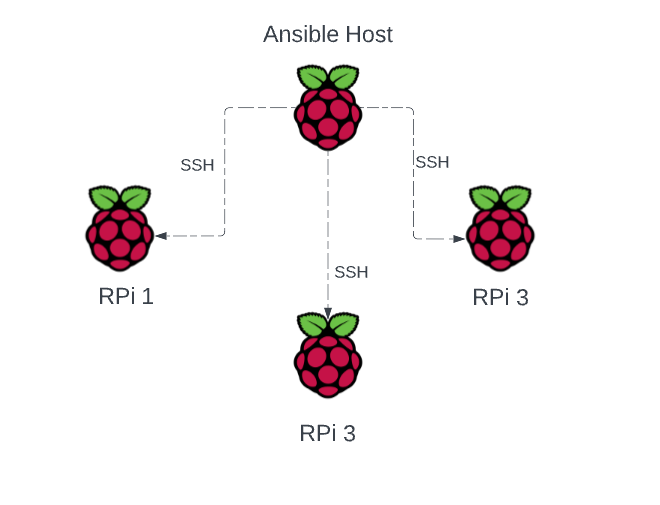

# raspberry-pi-ansible-updates
An Ansible script to run periodic maintenance on a farm of Raspberry Pis 


## Design Diagram



## Ansible Prep
Using Ansible requires very little configuration on the endpoint Raspberry Pi hosts, but it does need quite a bit of configuration on the ansible host.
1. First we need to create a key for connecting to each RPi. Do this on the ansible only. Run the `ssh-keygen` command and make sure you specify a passphrase. There are more details [here](https://www.ssh.com/academy/ssh/keygen). 
2. Now we need create the ssh agent so we don't have to keep typing in our passphrase each time we use Ansible. 
3. To make sure we keep the agent running forever on your ansible, add this to your bash startup script and reboot:
```bash
  SSH_ENV="$HOME/.ssh/agent-environment"

  function start_agent {
    echo "Initialising new SSH agent..."
    /usr/bin/ssh-agent | sed 's/^echo/#echo/' >"${SSH_ENV}"
    echo succeeded
    chmod 600 "${SSH_ENV}"
    . "${SSH_ENV}" >/dev/null
    /usr/bin/ssh-add
  }

  # Source SSH settings, if applicable

  if [ -f "${SSH_ENV}" ]; then
    . "${SSH_ENV}" >/dev/null
    #ps ${SSH_AGENT_PID} doesn't work under cywgin
    ps -ef | grep ${SSH_AGENT_PID} | grep ssh-agent$ >/dev/null || {
      start_agent
    }
  else
    start_agent
  fi
```
4. You will be asked _once_ for the passphrase after your ansible system reboots. After that, you won't have to worry about it until after the next reboot.
5. Now we need to configure the connections to each RPi endpoint.
6. Next, we configure the endpoints to be reached without using IDs and passwords. On your ansible host, on its command line, type the `ssh-copy-id` command. Do this for each RPi endpoint. 
```bash
╰─➤  ssh-copy-id hall.local
/usr/bin/ssh-copy-id: INFO: attempting to log in with the new key(s), to filter out any that are already installed
/usr/bin/ssh-copy-id: INFO: 1 key(s) remain to be installed -- if you are prompted now it is to install the new keys
Warning: Permanently added 'hall.local' (ED25519) to the list of known hosts.
tennis@hall.local's password:

Number of key(s) added: 1

Now try logging into the machine, with:   "ssh 'hall.local'"
and check to make sure that only the key(s) you wanted were added.
```
7. Make a copy of the `sample_hosts` file and call it `hosts`.  Substitute the the RPi names with your own Raspberry Pi names.
8. Install ansible using your package manager.  Since I'm using Ubuntu, here is that command
```bash
sudo apt-get install ansible -y
```
9. Now you're ready to try ansible.  In the ansible directory, try this ansible ping command: `ansible all -m ping`
```bash
╰─➤  ansible all -m ping
cat-doorbell.local | SUCCESS => {
    "changed": false,
    "ping": "pong"
}
garage-bot.local | SUCCESS => {
    "changed": false,
    "ping": "pong"
}
stair-lights.local | SUCCESS => {
    "changed": false,
    "ping": "pong"
}
front-porch-lights.local | SUCCESS => {
    "changed": false,
    "ping": "pong"
}
livingroom-clock.local | SUCCESS => {
    "changed": false,
    "ping": "pong"
}
office-clock.local | SUCCESS => {
    "changed": false,
    "ping": "pong"
}
```

## Example Invocation

```bash
ansible-playbook ./maintenance.yaml
```

